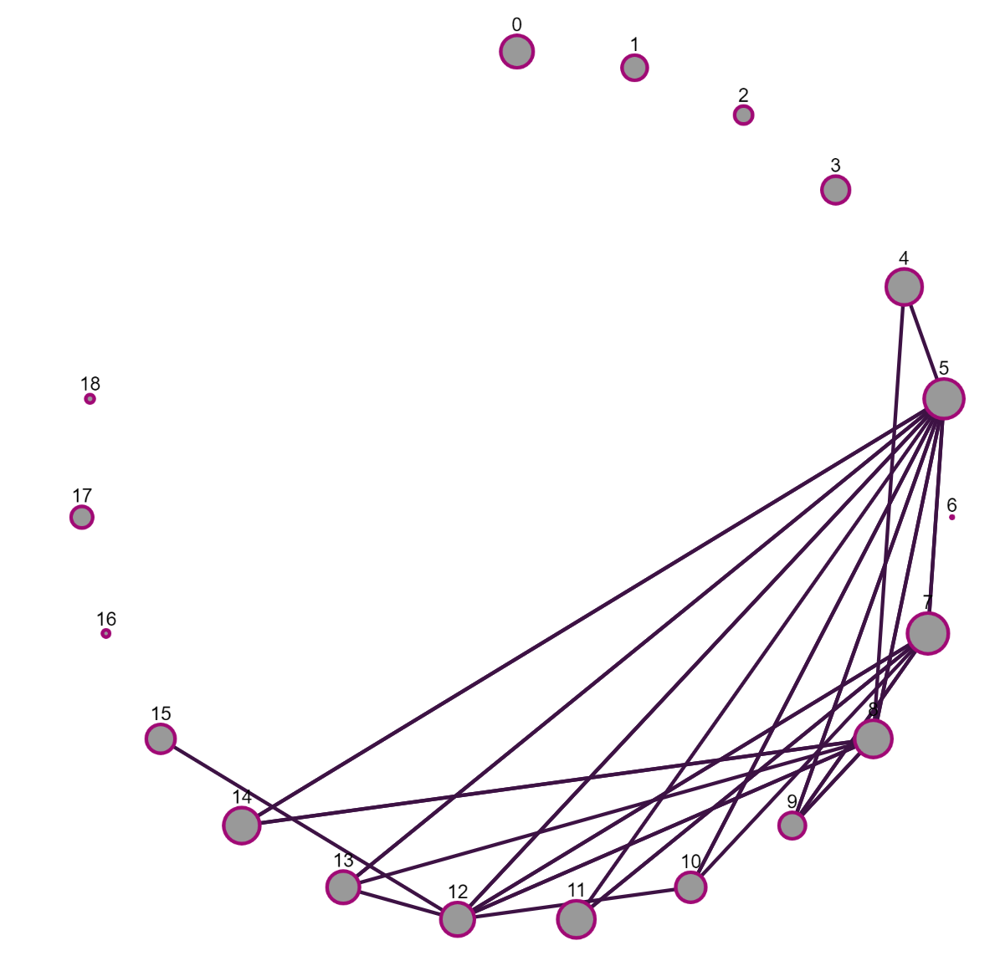
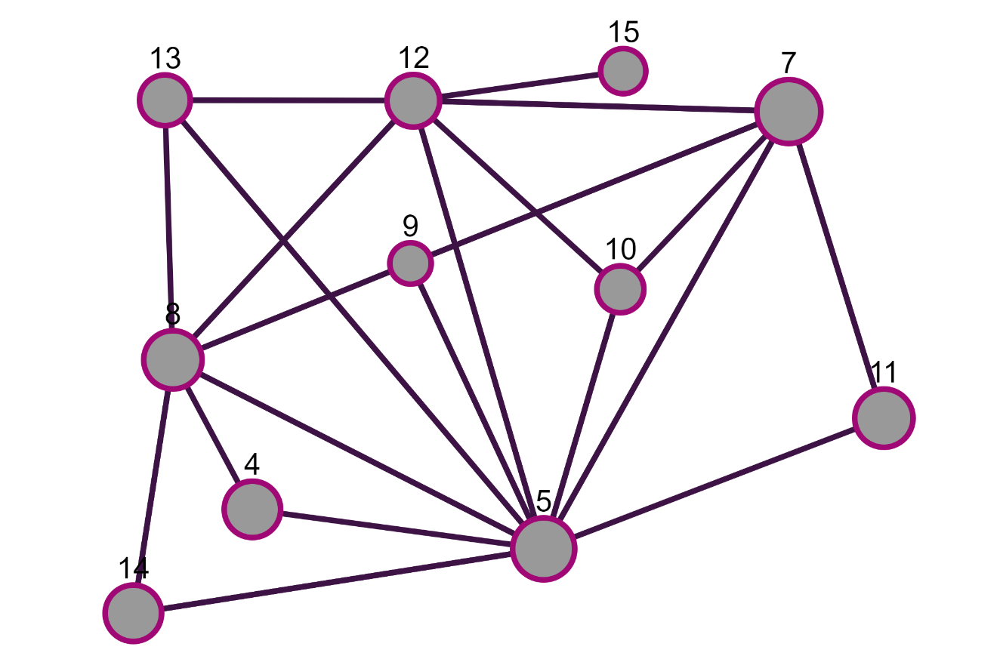
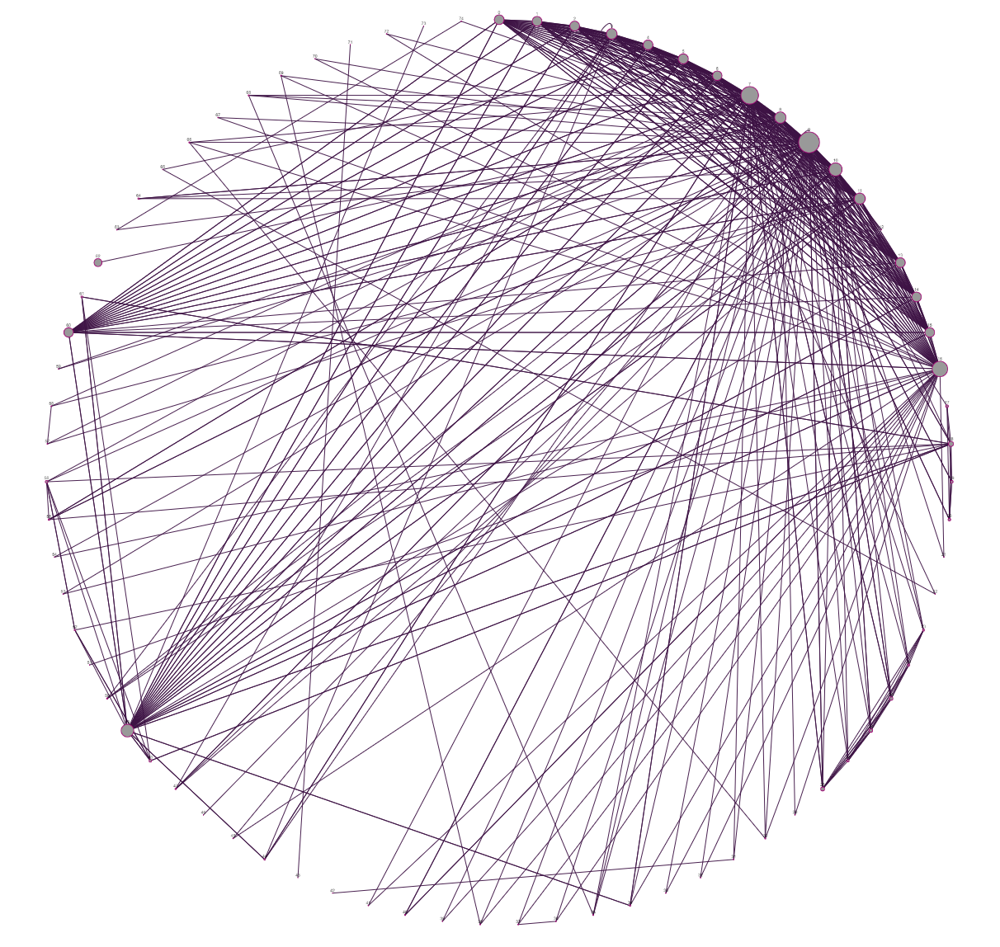
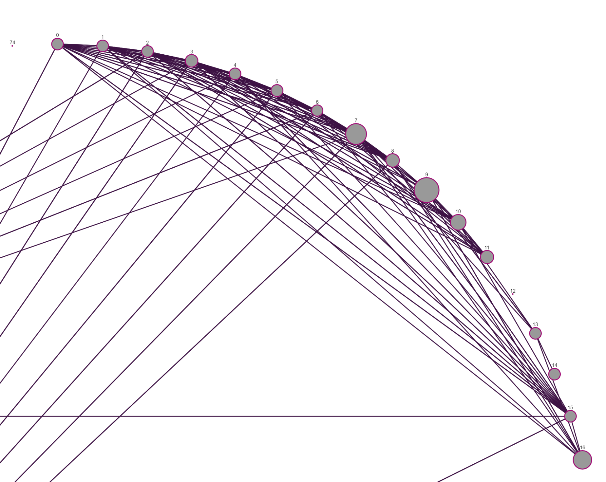

# Collaboration network
Quick proof of concept showing collaboration network by analysing Slack and Google Meets data.  

Companies have an official org chart but most of the collaboration is done through informal cooperation.  This collaboration network is often hidden from senior management and as a result, many company-wide initiatives such as digital transformation, mergers, and reorgs fail. 

Knowing how information flows and collaboration really happens is essential, especially at a time when more and more companies are worried about the creative impact of remote work.

A field called Organisational Network Analysis (ONA) tries to solve this problem by visualising collaboration as a network of nodes and edges. This approach can reveal staff member nodes that are overloaded, disengaged, information brokers, bottlenecks, or are acting as bridges between distinct clusters of nodes. 

There is an article about this [here](https://www2.deloitte.com/us/en/pages/human-capital/articles/organizational-network-analysis.html)

## Using Slack and Google Meets to reveal H&Cs collaboration network 
The data to do this is readily available in Slack and GSuite. I imagine Microsoft Teams/365 also has it. 

I looked to see if I could produce a network for a specific project team by downloading Slack logs from public rooms (quite rightly only public channels are available) and treating @ messages as creating a directed edge between the sender and the recipient. 
Edges are weighted according to the number of messages between the nodes. 

### Slack network

The network is produced in BuildSlackGraph.fsx and visualised in VisualiseGraph.fsx

I have replaced the team member names with numbers to protect anonnyimity.

It shows that node 5 is playing a crucial role. This may be a strength or weakness of the team. The same data in a different representation shows this even more clearly.

Node 5 could well be a bottle next in this team. At the very least they probably feel overloaded and the team would work more efficiently with greater collaboration between other members. For example, nodes 1, 4, and 11 should probably have at least one direct link between them.  

Of course, Slack usage is not the whole story. Many people don't use it much or are primarily ["System 2"](https://en.wikipedia.org/wiki/Thinking,_Fast_and_Slow) workers who actively avoid giving and receiving interruptions via Slack. 

For this reason, I also looked at visualising the Meets meetings.

### Meets network
Meets data can be downloaded from the admin console of GSuite. It is a little more difficult to work with as it just has log events for when users enter and leave Meeting rooms (Meeting code).

To build the network the code folds over the log events and calculates when any pair of workers were in a meeting room at the same time. An undirected edge is then created with a weight equal to the number of seconds they overlapped. 

This network looks like this 

Quite pretty but not very useful. Making the network sparser, ie reducing the number of links, makes it more interesting. This is done by filtering edges according to their weight which is the number of seconds. Setting it to 20,000 results in the following

The size of each node indicates its number of connections (degree)

We can see that nodes 7 and 9 are spending a good deal of time in meetings with a large number of different people. This could indicate collaborative overload, excessive meeting culture, or even that they are simply being invited to too many meetings which could probably be conducted with them. 

Further filtering and an alternative layout shows that while node 3 has less total connections than 9, they are spending a large amount of time in meetings with distinct groups. Perhaps nodes 1,2 and 7,8 should have a regular catchup to reduce pressure on node 3. 

## Further analysis
Other data sources such as calendar events and document collaboration could also be mined to refine the network.
These techniques would work better in very large companies and would need to be combined with other "people" data. It also cant produce unambiguous results and network diagrams would always need substantial interpretation.

